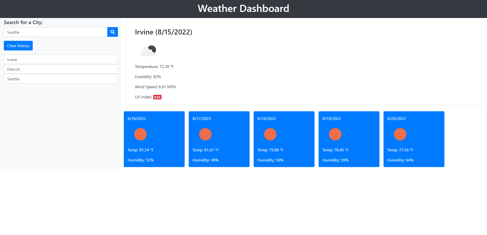

# 06-Weather-Dashboard

## Challenge User Story

```
AS A traveler
I WANT to see the weather outlook for multiple cities
SO THAT I can plan a trip accordingly
```

## Challenge Acceptance Criteria

```
GIVEN a weather dashboard with form inputs
WHEN I search for a city
THEN I am presented with current and future conditions for that city and that city is added to the search history
WHEN I view current weather conditions for that city
THEN I am presented with the city name, the date, an icon representation of weather conditions, the temperature, the humidity, the wind speed, and the UV index
WHEN I view the UV index
THEN I am presented with a color that indicates whether the conditions are favorable, moderate, or severe
WHEN I view future weather conditions for that city
THEN I am presented with a 5-day forecast that displays the date, an icon representation of weather conditions, the temperature, the wind speed, and the humidity
WHEN I click on a city in the search history
THEN I am again presented with current and future conditions for that city
```

## My Goal
I will create an application that fulfils the requirements above. The code will make use of the following 3rd party APIs:
* [Bootstrap](https://getbootstrap.com/docs/4.5/getting-started/introduction/) as a css framework and customized accordingly
* [Google Fonts](https://fonts.google.com/) for custom fonts that don't require installation
* [jQuery](https://api.jquery.com/) for dynamic rendering of the html content based on user interaction
* [Moment.js](https://momentjs.com/) for time and date related manipulations
* [OpenWeather On Call API](https://openweathermap.org/api/one-call-api) for city weather data.
* [Font Awesome](https://fontawesome.com/docs/web/) for access to their icon library.

## Grading Requirements

This Challenge is graded based on the following criteria: 

### Technical Acceptance Criteria

* Satisfies all of the above acceptance criteria plus the following:

    * Uses the OpenWeather API to retrieve weather data.

    * Uses `localStorage` to store persistent data.

### Deployment

* Application deployed at live URL.

* Application loads with no errors.

* Application GitHub URL submitted.

* GitHub repository that contains application code.

### Application Quality

* Application user experience is intuitive and easy to navigate.

* Application user interface style is clean and polished.

* Application resembles the mock-up functionality provided in the Challenge instructions.

### Repository Quality

* Repository has a unique name.

* Repository follows best practices for file structure and naming conventions.

* Repository follows best practices for class/id naming conventions, indentation, quality comments, etc.

* Repository contains multiple descriptive commit messages.

* Repository contains quality readme file with description, screenshot, and link to deployed application.

## Review

You are required to submit BOTH of the following for review:

* The URL of the functional, deployed application.

* The URL of the GitHub repository. Give the repository a unique name and include a readme describing the project.

## Application Screenshot

The following image shows the web application's appearance and functionality:



## Application Link

The following is a link to the deployed application in GitHub pages.

[James Li Challenge 06: 3rd Party APIs](https://jimjamlee.github.io/06-Weather-Dashboard/)